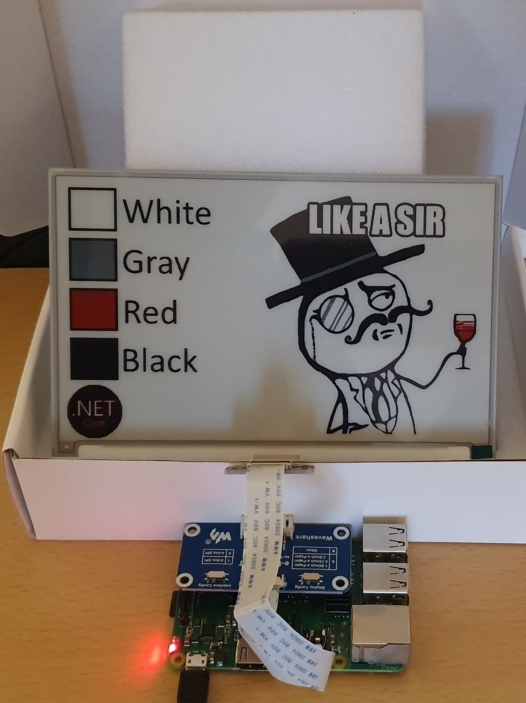

# Waveshare.EPaperDisplay
Library for .Net Core to control a Waveshare E-Paper Display

Currently only supports the Model: Waveshare 7.5inch e-Paper (B)

## Based on:

Specification from:
https://www.waveshare.com/w/upload/2/29/7.5inch_e-paper-b-Specification.pdf

C Example Code from:
https://github.com/waveshare/e-Paper/tree/master/RaspberryPi%26JetsonNano/c

## Usage for a public static method:

```C#
public static void Main()
{
	const string fileName = "yourImage.bmp";
	using var bitmap = new Bitmap(Image.FromFile(fileName, true));

	using var ePaperDisplay = EPaperDisplay.Create(EPaperDisplayType.WaveShare7In5Bc);
  
	ePaperDisplay.Clear();
	ePaperDisplay.WaitUntilReady();
	ePaperDisplay.DisplayImage(bitmap);
	ePaperDisplay.Sleep();
}
```

## Example running on Raspberry Pi 3



## License
[MIT](LICENSE)
